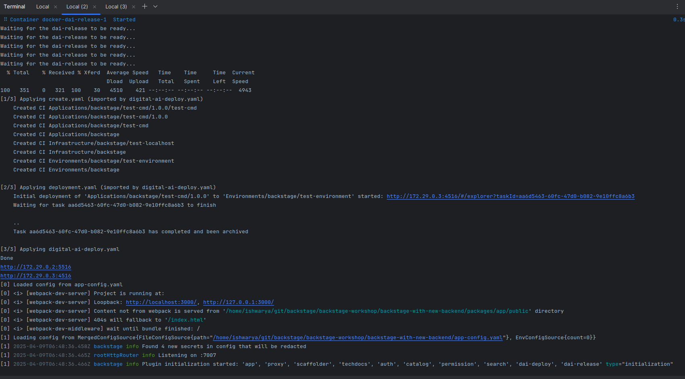

# Backstage Workshop
# Setup of Digital-ai Deploy and Digital-ai Release
## Setup Digital-ai Deploy [optional]
### 1. Run the following command to run deploy in docker container. [More details on docker images of xl-deploy](https://hub.docker.com/r/xebialabs/xl-deploy)
```shell
docker run -e "ADMIN_PASSWORD=admin" -e "ACCEPT_EULA=Y" -p 4516:4516 -d --name xld xebialabsunsupported/xl-deploy:24.1
```
### 2. Run the following command to create Application, Infrastructure, Environment  and deploy the application in the created Environment using Digital-ai Deploy. 
#### Run the command from the root directory.
```shell
docker pull xebialabsunsupported/xl-client:24.1
```
```shell
docker run  -v $(pwd):$(pwd) -w $(pwd) xebialabsunsupported/xl-client:24.1 apply -f docker/deploy/digital-ai-deploy.yaml --xl-deploy-url http://<deployhost>:4516/ -name xlcli
```
Note: Before Running the above command please update  "http://<deployhost>:4516/" with actual deploy url.

## Setup Digital-ai Release [optional]
### 1. Run the following command to run deploy in docker container. [More details on docker images of xl-release](https://hub.docker.com/r/xebialabs/xl-release)
```shell
docker run -e "ADMIN_PASSWORD=admin" -e "ACCEPT_EULA=Y" -p 5516:5516 -d --name xlr-23.3 xebialabsunsupported/xl-release:24.1
```

# Setup of Digital-ai Deploy , Digital-ai Release and Backstage using script available under docker directory.
## Prerequisites
1. Install docker and docker-compose.
2. Run the following command from the root directory of the backstage.
   - Before running the command update the following property as required in the docker/dai-backstage_up.sh.
   - If we want to run the backstage in docker set the value of START_BACKSTAGE_IN_DOCKER to true in dai_backstage_up.sh
```shell
# Set Network, Environment variables and start the services.
export NETWORK_NAME=dai-backstage
export DAI_RELEASE_IMAGE=xebialabs/xl-release:24.3
export DAI_DEPLOY_IMAGE=xebialabs/xl-deploy:24.3
export DAI_BACKSTAGE_IMAGE=xebialabsunsupported/dai-backstage-docker:1.0.1
export DAI_DEPLOY_USERNAME=admin
export DAI_DEPLOY_PASSWORD=admin
export GITHUB_TOKEN=<GITHUB_TOKEN>
export AUTH_GITHUB_CLIENT_ID=<AUTH_GITHUB_CLIENT_ID>
export AUTH_GITHUB_CLIENT_SECRET=<AUTH_GITHUB_CLIENT_SECRET>
export START_BACKSTAGE_IN_DOCKER=false
```
3. Run following command from root directory
```shell
cd backstage-with-new-backend
yarn install
```
4. Run the following command to start the deploy, release and backstage
```shell
cd docker
./dai-backstage_up.sh
```
5. Logs 

6. View the Digital-ai Deploy - Active Deployment in Backstage app.

7. View the Digital-ai Deploy - Archive Deployment in Backstage app.

8. View the Digital-ai Release - Active Release in Backstage app.

9. View Digital-ai Release - Template in Backstage app.

10. View Digital-ai Release - Workflow in Backstage app.
 

## Configure npmrc file with the following content, available in home directory.
1. Windows  
   a.%USERPROFILE%\.npmrc **(eg: C:\Users\username\.npmrc)**
2. Linux 
   a.~/.npmrc **(eg: /home/username/.npmrc)**
3. Mac
   a.~/.npmrc **(eg: /Users/username/.npmrc)**
4. Content of the npmrc file.
   a. Add the following content to the npmrc file.

```shell
# THIS IS AN AUTOGENERATED FILE. DO NOT EDIT THIS FILE DIRECTLY.
# yarn lockfile v1
registry=https://registry.npmjs.org/
strict-ssl=false
@digital-ai:registry=https://registry.npmjs.org
```

## Setup backstage using legacy backend system.
#### 1. Run the following command from root directory
```shell
cd backstage-with-legacy-backend
```
#### 2. Configure the deploy and release instance from previous step or else configure the existing instance by adding the following to your app-config.yaml files.
```yaml
daiDeploy:
  host: http://<deployhost>:4516
  username: '<username>'
  password: '<password>'
  
daiRelease:
   instances:
      - name: 'Production'
        host: http://<releasehost>:5516/
        token: <ACCESS-TOKEN> # Generated token from the release instance.
      - name: 'QE'
        host: http://<releasehost>:5516/
        token: <ACCESS-TOKEN> # Generated token from the release instance.
      - name: 'Staging'
        host: http://<releasehost>:5516/
        token: <ACCESS-TOKEN> # Generated token from the release instance.
```

#### 3. Run the following command to start the backstage app with deploy plugin installed.
```shell
yarn install
```
```shell
yarn dev
```

## Setup backstage using New backend system.
#### 1. Run the following command from root directory
```shell
cd backstage-with-new-backend
```
#### 2. Configure the deploy and release instance from previous step or else configure the existing instance by adding the following to your app-config.yaml files.
```yaml
daiDeploy:
  host: http://<deployhost>:4516
  username: 'admin'
  password: 'admin'
daiRelease:
  host: http://<releasehost>:5516
  token: rpa_862c5cd8b6e76f551d4f4b2e862e1e8a34be3972 # Generated token from the release instance.
```
#### 3. Run the following command to start the backstage app with deploy plugin installed.
```shell
yarn install
```
```shell
yarn dev
```

# To run the backstage in docker with the github auth , dai-release and dai-deploy plugin:
Refer the [docker/README.md](docker/README.md) for more details.


## Documentation Links

**Digital.ai Deploy:**

* [Deploy Integration with Backstage](https://docs.digital.ai/bundle/devops-deploy-version-v.24.1/page/deploy/concept/xl-deploy-backstage-overview.html)
* [Adding Deploy to Your Backstage IDP](https://docs.digital.ai/bundle/devops-deploy-version-master/page/deploy/concept/xl-deploy-backstage-plugins.html)

**Digital.ai Release:**

* [Overview](https://docs.digital.ai/bundle/devops-release-version-v.24.1/page/release/concept/release-backstage-overview.html)
* [Adding Release Plugin to Your Backstage IDP](https://docs.digital.ai/bundle/devops-release-version-v.24.1/page/release/concept/release-backstage-plugin.html)


